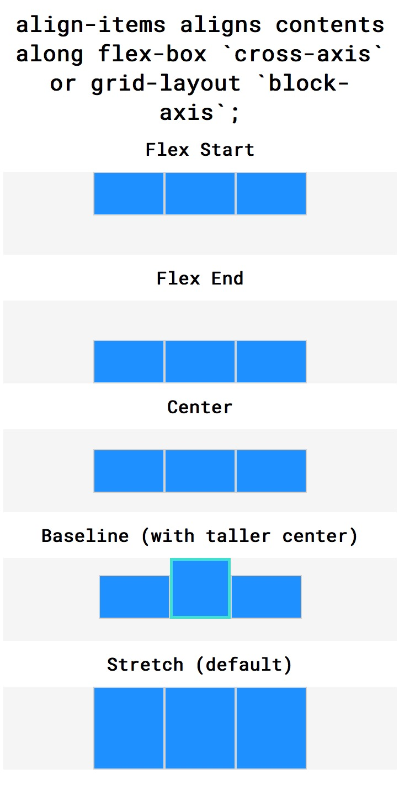
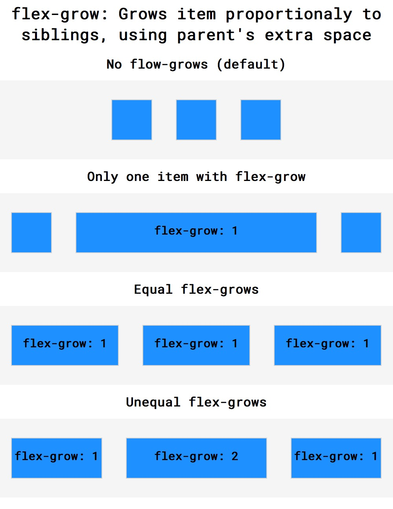

Grum's CSS notes
-------------------------------------------

Contains an overview of CSS covered in the Codecademy Web Path courses and [links](https://developer.mozilla.org/en-US/docs/Web/CSS) to Mozilla documentation. 

**Contents**

<!-- @import "[TOC]" {cmd="toc" depthFrom=1 depthTo=6 orderedList=false} -->

<!-- code_chunk_output -->

- [Setting page layouts](#setting-page-layouts)
    - [The Box Model](#the-box-model)
        - [Sizing with `height`, `width`, `padding`, `borders`, and `margins`](#sizing-with-height-width-padding-borders-and-margins)
            - [Padding and margin arguments](#padding-and-margin-arguments)
    - [Changing the Box Model](#changing-the-box-model)
        - [`box-sizing` `: [content-box (default), border-box]`](#box-sizing--content-box-default-border-box)
    - [Controlling and positioning of elements on a web page.](#controlling-and-positioning-of-elements-on-a-web-page)
        - [`display` `: [inline, block, inline-block]`](#display--inline-block-inline-block)
        - [`position` `: static (default), relative, absolute, fixed`](#position--static-default-relative-absolute-fixed)
        - [`z-index` `: [int]`](#z-index--int)
        - [`float` `: [left, right]`](#float--left-right)
        - [`clear` `: [left, right, both]`](#clear--left-right-both)
    - [\<length\> - units for sizing and positioning - `px, em rem, %, auto`, etc](#length---units-for-sizing-and-positioning---px-em-rem--auto-etc)
        - [Absolute units](#absolute-units)
        - [Relative units](#relative-units)
    - [Flexbox layouts](#flexbox-layouts)
        - [Overview of flexbox properties](#overview-of-flexbox-properties)
            - [Flex-box `main-axis` and `cross-axis`](#flex-box-main-axis-and-cross-axis)
        - [`justify-content` - justify _contents_ along the `main-axis` of container](#justify-content---justify-contents-along-the-main-axis-of-container)
        - [`align-items` - align _contents_ along flex-box `cross-axis` or grid-layout `block-axis`](#align-items---align-contents-along-flex-box-cross-axis-or-grid-layout-block-axis)
        - [`flex-grow` - grow _item_ proportionaly to others, using parent's extra space](#flex-grow---grow-item-proportionaly-to-others-using-parents-extra-space)
        - [`flex-shrink`](#flex-shrink)
        - [`flex-basis`](#flex-basis)
        - [`flex`](#flex)
        - [`flex-wrap`](#flex-wrap)
        - [`align-content`](#align-content)
        - [`flex-direction`](#flex-direction)
        - [`flex-flow`](#flex-flow)
- [Colors](#colors)
    - [`color` and `background-color` `[ keyword #, rgb, hsl, rgba, hsla]`;](#color-and-background-color--keyword--rgb-hsl-rgba-hsla)
    - [Solid colors - `keyword, #, rgb, hsl`](#solid-colors---keyword--rgb-hsl)
    - [Alpha and Opacity](#alpha-and-opacity)
        - [Setting with `rgba` and `hsla`](#setting-with-rgba-and-hsla)
        - [Setting via `opacity` `: real-decimal`](#setting-via-opacity--real-decimal)
- [Typography](#typography)
    - [Typography properties (`font-family` et al)](#typography-properties-font-family-et-al)
    - [Loading additional fonts](#loading-additional-fonts)
        - [Loading externally from fonts.google.com](#loading-externally-from-fontsgooglecom)
        - [Loading internally using font files](#loading-internally-using-font-files)
- [Detecting browser information with `@media` rules](#detecting-browser-information-with-media-rules)
    - [Logical operators between `@media` rules](#logical-operators-between-media-rules)
        - [`and` (and)](#and-and)
        - [`,` (or)](#or)
        - [Chaining `and` and `,`](#chaining-and-and)
    - [Rules for display `width` and `height`](#rules-for-display-width-and-height)
    - [Rules for ranges of values](#rules-for-ranges-of-values)
    - [Rules for `resolution` DPI in \<resolution\> units](#rules-for-resolution-dpi-in-resolution-units)
        - [Rule for screen `orientation`](#rule-for-screen-orientation)
    - [Rules for specific device and orientation](#rules-for-specific-device-and-orientation)
- [Creating responsive websites](#creating-responsive-websites)
    - [Use relative units when sizing and positioning](#use-relative-units-when-sizing-and-positioning)
    - [Use `@media` rules to address layout issues](#use-media-rules-to-address-layout-issues)
        - [Finding where layouts break or look odd](#finding-where-layouts-break-or-look-odd)
- [Design patterns](#design-patterns)
    - [Background images `background`](#background-images-background)
    - [Image and video proportional scaling](#image-and-video-proportional-scaling)
- [Tips and trips](#tips-and-trips)
    - [How to work out the effect of declarations](#how-to-work-out-the-effect-of-declarations)
    - [Avoid `padding` of `inline` objects like \'s, instead use `margin` on their containers](#avoid-padding-of-inline-objects-like-imgs-instead-use-margin-on-their-containers)

<!-- /code_chunk_output -->

---

# Setting page layouts

## The Box Model

<a id="__sizing"></a>

### Sizing with `height`, `width`, `padding`, `borders`, and `margins`

* The five properties of the box model are: `height` and `width`, `padding`, `borders`, and `margins`.
* The box model uses the five properties to create space around and between HTML elements;
    *   [](./Codecademy-The_Box_Model_1-overview.jpg)
*   See [here](#__units) for the fixed and relative units that can be used to set the properities.

| Property | Effect |
| :------: | ------ |
| [`height`](https://developer.mozilla.org/en-US/docs/Web/CSS/@viewport/height)[[1]](#__display_warning) <br>[`width`](https://developer.mozilla.org/en-US/docs/Web/CSS/width)[[1]](#__display_warning) <br>`min-width`<br>`max-width`<br>`min-height`<br>`max-height` | Sets content area. <br> **NB**: Can combine min & max to limit scaling in two directions. E.g. <br>`div.container { `<br>`  min-height: 150px;`<br>`  max-height: 600px;`<br>`  min-width: 300px;`<br>`  max-width: 900px; `<br>`}`
| [`border`](https://developer.mozilla.org/en-US/docs/Web/CSS/border) | Surrounds the content area and padding of an element. The color, <br>style, and thickness of a border can be set with CSS properties. <br>E.g. `border: 3px solid #eb6536` sets line width, type of line, and<br> color of line
| [`padding`](https://developer.mozilla.org/en-US/docs/Web/CSS/padding)[[1]](#__display_warning) <br>`padding-top`, <br>`padding-bottom`, <br>`padding-right`, <br>`padding-right` | Sets the spacing between the content area and the border. For <br>`padding`, the [number of arguments](#__padding_margin_args) changes which faces the arg(s)<br> apply to.
| [`margin`](https://developer.mozilla.org/en-US/docs/Web/CSS/margin)[[1]](#__display_warning) <br>`margin-top`, <br>`margin-bottom`, <br>`margin-right`, <br>`margin-left` | Sets the spacing outside of an element's border; <br> **1)** For `margin`, the [number of arguments](#__padding_margin_args) changes which faces the <br>arg(s) apply to.<br>**2) `margin: 0 auto`** sets no top-bottom margins, but **horizontally<br> centers** an element inside of its parent content area, if it has a width.<br>**3) Vertical margin collapse**; <br> **- Vertical** margins collapse, so the space between vertically adjacent <br>elements is equal to the larger margin.<br> **- Horizontal** margins add, so the total space between the borders of<br> adjacent elements is equal to the sum of the right margin of one <br>element and the left margin of the adjacent element.<br>[](Codecademy-Virtual_Margins_Collapse.jpg)
| [`overflow`](https://developer.mozilla.org/en-US/docs/Web/CSS/overflow) | Property can be set to `display`, `hide`, or `scroll`, and dictates how<br> HTML will render content that overflows its parent's content area.
| [`visibility`](https://developer.mozilla.org/en-US/docs/Web/CSS/visibility) |Property can hide or show elements.

<a id="__display_warning"></a>

 **[1] WARNING**: If the element [`display`](#display--inline-block-inline-block) defaults to, or is set to, **`inline`**, it causes the element to be as small as possible and hence partially, or fully, negates any `height`, `width`, `padding` and `margin` settings.

<a id="__padding_margin_args"></a> 

#### Padding and margin arguments

The number of arguments changes which faces the arguments apply to as follows;

| Args | Faces Applied To | Example |
| :--: | ---------------- | ------- |
| 1    | All four faces. | `padding: 20px;`
| 2    | 1st: Top & bottom<br>2nd: Both sides| `margin: 10px 20px;`
| 3    | 1st: Top<br>2nd: Both sides<br>3rd: Bottom| `padding: 10px 20px; 5px;`
| 4    | 1st: Top<br>2nd: Right side<br> 3rd: Bottom<br>4th: Left side |  `margin: 10px 20px 5px 50px;`


## Changing the Box Model

### [`box-sizing`](https://developer.mozilla.org/en-US/docs/Web/CSS/box-sizing) `: [content-box (default), border-box]`
The box-sizing property controls the box model used by the browser;

| Setting | Effect |
| :-----: | :----: |
| `content-box` | Box dimensions are affected by border thickness and padding, as<br> these are external to the box, and hence add to the content dimensions. <br>[](Codecademy-The_Box_Model_2-default_acutal_rendered_width.jpg)
| `border-box` | Box dimensions are not affected by border thickness or padding, <br>instead these go into the box.<br> [](Codecademy-The_Box_Model_3-box-sizing_border-box.jpg)

<a id="__positioning">

## Controlling and positioning of elements on a web page.

### [`display`](https://developer.mozilla.org/en-US/docs/Web/CSS/display) `: [inline, block, inline-block]`
* The display property allows control of how an element flows vertically and horizontally.

| Setting | Effect |
| :-----: | ------ |
| `inline` | Elements take up the minimum size required to contain the contents and cannot<br> be altered in size with the `height` or `width` properties. See [here](https://developer.mozilla.org/en-US/docs/Web/HTML/Inline_elements) for more.
| `block` | Elements fill the entire width of the page by default, but their width property can<br> also be set. Unless otherwise specified, they are the height necessary to<br> accommodate their content. The main block-by-default elements are<br> `<h1> through <h6>, <p>, <div> and <footer>`, see [here](https://developer.mozilla.org/en-US/docs/Web/HTML/Block-level_elements) for more.
| `inline-block` | Elements can also appear next to each other, can have set `width` and `height`,<br> and do not take up their entire container width.
| `flex` | Elements will remain block level — no other elements will appear on the same<br> line as it.|
| `inline-flex`| Elements will be flex containers that are also inline elements.|

### [`position`](https://developer.mozilla.org/en-US/docs/Web/CSS/position) `: static (default), relative, absolute, fixed`

| Setting | Effect |
| :-----: | ------ |
| `static` | Default value. Elements render in order, as they appear in the document flow
| `relative` | Position relative to its default position on the page.
| `absolute` | Position relative to its first positioned (not static) ancestor element. It can be pinned to any part of the web page, but the element will still move with the rest of the document when the page is scrolled.
| `fixed` | Position pinned to any part of the web page. The element will remain in view no matter what. <br>If an element's `position` is `fixed`;<br>**1)** The element may be obscured underneath others, so `z-index: <a_suitably_big_int>` can bring the element forward. Which may in turn obscure other element(s), which then need to have their position altered to be visiable again.  e.g. Set their `position:relative`, and then push them down using `top:<the_height_of_the_obscuring_element>px`.<br>**2)** The element may shrink, which `width: 100%` can address, provided the `display` for the element is not `inline`.
| `sticky` | Position relative to its default position on the page until its containing block crosses a specified threshold (such as setting top to value other than auto) within its flow root (or the container it scrolls within), at which point it is treated as "stuck" until meeting the opposite edge of its containing block.

* Once `position` is changed from `static`, the element's position can be modified using the [`top`](https://developer.mozilla.org/en-US/docs/Web/CSS/top), [`bottom`](https://developer.mozilla.org/en-US/docs/Web/CSS/bottom), [`left`](https://developer.mozilla.org/en-US/docs/Web/CSS/left), [`right`](https://developer.mozilla.org/en-US/docs/Web/CSS/right) properties, using  `auto`, `inherit`, or any of [these units](#__units).

### [`z-index`](https://developer.mozilla.org/en-US/docs/Web/CSS/z-index) `: [int]`
* The `z-index` of an element specifies how far back or how far forward an element appears on the page when it overlaps other elements. 
* The higher the number, the closer to the top of the stack
* WARNING: z-index will not function if position either defaults, or is set to, static.
* See also [Using z-index](https://developer.mozilla.org/en-US/docs/Web/CSS/CSS_Positioning/Understanding_z_index/Adding_z-index) article

### [`float`](https://developer.mozilla.org/en-US/docs/Web/CSS/float) `: [left, right]`
* Move elements as far `left` or `right` as possible.
* Floated elements must have a `width` specified, otherwise the element will assume the full width of its containing element, and changing the float value will not yield any visible results.
* The float property can also be used to float multiple elements at once. However, when multiple floated elements have different heights, it can affect their layout on the page. Specifically, elements can "bump" into each other and not allow other elements to properly move the left or right.

### [`clear`](https://developer.mozilla.org/en-US/docs/Web/CSS/clear) `: [left, right, both]`

* When multiple `floated` elements have different heights, they can "bump" into each other and not allow other elements to properly move to the left or right.

* The `clear` property specifies how elements should behave when they bump into each other on the page. 

| Setting | Effect |
| ------- | ------ |
| `left` | The left side of the element will not touch any other element within the same containing element.
| `right` | The right side of the element will not touch any other element within the same containing element.
| `both` | Neither side of the element will touch any other element within the same containing element.
| `none` | The element can touch either side.

 
<a id="__units"></a>

## [\<length\>](https://developer.mozilla.org/en-US/docs/Web/CSS/length) - units for sizing and positioning - `px, em rem, %, auto`, etc 

- Units can be applied when sizing and positioning elements and their contents

<a id="__absolute_units"></a>

### Absolute units

- Absolute units represent a physical measurement when the physical properties of the output medium are known, such as for print layout. E.g. `padding: `**`20px`**`;`

| Unit    | Physical property | Conversion | In `px`
| :-----: | ----------- | ------- | ------: |
| `px` | Pixels. | For low-res displays, equals 1 display pixel (dot).<br> For printers and high-resolution screens, 1 `px`<br> implies multiple device pixels. | 1
| `cm` | Centermeters | 1cm = 96px/2.54 | ~37.8
| `mm` | Milimeters | 1mm = 96px/25.4 | ~3.8
| `in` | Inches | 1in = 96px |96
| `pc` | Picas | 1pc = 12pt = 1/6th of 1in | 16
| `pt` | Points | 1pt = 1/72nd of 1in | ~ 1.3

<a id="__relative_units"></a>

### Relative units

- Relative lengths represent size in terms of some other distance. Depending on the unit, this can be the size of a specific character, the line height, or the size of the viewport.

| Unit | Description | Example |
| :--: | ----------- | ------- |
| `em`    | Multiple of base (i.e. parent element's) font-size that<br> is in use. <br>Use when sizing elements in comparison to other<br> elements nearby. | `font-size: `**`1.25em`**`;`
| `rem`   | Multiple of root element (i.e. \<html\> tag) font-size.<br>Use when sizing elements consistently <br>across entire page. |`line-height: `**`1.6rem`**`;`
| `%`     | Size element relative to the dimensions of parent<br> element (i.e. container).<br>**NB:** For `padding` & `margin`, the `%` for all four sides <br>is computed using the **width** of the **parent** element.<br>**WARNING**: If used with box-model, may<br> cause overflow problems | `width: `**`60%`**`;`
| `auto`  |  The browser will calculate and select a width for the<br> specified element. E.g. If the height property of an<br> image is set to auto, the image's height will<br> automatically scale proportionally with the width. <br>**WARNING:** `auto` may be the default or inherited, in<br> which case `auto` appears to do nothing.| `height: `**`auto`**;
| `ch` <br>`vh` <br>`vw` <br>`vmin` <br>`vmax`| See [\<length\>](https://developer.mozilla.org/en-US/docs/Web/CSS/length) for details. | 

- **NB**: When using relative sizing, to create a consistent layout based on text size and text-related dimensions on the page (i.e. padding around text), use `ems` and `rems`. Otherwise, percentages should be used.

<a id="__@media"></a>

## Flexbox layouts
- A flex container is an element on a page that contains flex items.
- All direct child elements of a flex container are flex items. 
- Some of the properties apply to flex containers, while others apply to flex items.

### Overview of flexbox properties
- To designate an element as a flex container, set `display` of element to `flex` or `inline-flex`
- Flex items and containers can have the following properties set;

| Property                             | Purpose |
| :----------------------------------: | ------ |
| [`justify-content`](#justify-content)| Distributes space between and around content items along the main-axis of their container.
| [`align-items`](#align-items)        |
| [`flex-grow`](#flex-grow)            |
| [`flex-shrink`](#flex-shrink)        |
| [`flex-basis`](#flex-basis)          |
| [`flex`](#flex)                      |
| [`flex-wrap`](#flex-wrap)            |
| [`align-content`](#align-content)    |
| [`flex-direction`](#flex-direction)  | 
| [`flex-flow`](#flex-flow)            |

#### Flex-box [`main-axis`](https://developer.mozilla.org/en-US/docs/Glossary/main_axis) and [`cross-axis`](https://developer.mozilla.org/en-US/docs/Glossary/cross_axis)
- The behaviour of many flex-box properties are dependent on the `main-axis` and `cross-axis`, which are set by the `flex-direction` property.  The `cross-axis` is alwaysperpendicular to the `main-axis`.
- See heading links for diagrams.

### [`justify-content`](https://developer.mozilla.org/en-US/docs/Web/CSS/justify-content) - justify _contents_ along the `main-axis` of container
- Distribute space between and around content items along the `main-axis` of their container.
  
| Setting | Effect |
| :-----: | ------ |
| `flex-start       ` | Pack flex items from the start
| `flex-end         ` | Pack flex items from the end
| `center           ` | Pack items around the center
| `space-around     ` | Distribute items evenly. <br> Items have a half-size space on either end.
| `space-between    ` | Distribute items evenly. <br>The first item is flush with the start, the last is flush with the end.
| `start            ` | Pack items from the start
| `end              ` | Pack items from the end
| `left             ` | Pack items from the left
| `right            ` | Pack items from the right
| `space-evenly     ` | Distribute items evenly <br> Items have equal space around them.
| `stretch          ` | Distribute items evenly. <br>Stretch 'auto'-sized items to fit the container.
| `safe <setting>   ` | If the item overflows the alignment container causing data loss, <br>the item is instead aligned as ifthe alignment mode were start.
| `unsafe <setting> ` | Regardless of the relative sizes of the item and alignment container<br> and whether overflow which causes data loss might happen,<br> the given alignment value is honored.

- E.g. Pic and [code](./flex-box/justify-content/index.html) from course;;
  
[](./flex-box/justify-content/example.jpg)

### [`align-items`](https://developer.mozilla.org/en-US/docs/Web/CSS/align-items) - align _contents_ along flex-box `cross-axis` or grid-layout `block-axis`
- Sets the align-self value on all direct children as a group
- Sets the alignment of an item within its containing block.

| Setting | Effect on `cross-axis` |
| :-----: | ------ |
| `flex-start              ` |  Pack `flex` items from the start
| `flex-end                ` |  Pack `flex` items from the end
| `center                  ` |  Pack items around the center
| `baseline`<br>`first baseline`<br>`last baseline` |  The bottom of the content of all items will be aligned with each other.
| `stretch `<br>(default)    |  If possible, the items will stretch from top to bottom of the container<br> **IMPORTANT:** <br>-  Elements with a specified height will not stretch. <br> - Elements with a minimum height **OR** no height specified will stretch.
| `normal                  ` |  Depends on the layout mode
| `start                   ` |  Pack items from the start 
| `end                     ` |  Pack items from the end 
| `self-start              ` |  
| `self-end                ` |  
| `safe <setting>          ` | If the item overflows the alignment container causing data loss, <br>the item is instead aligned as ifthe alignment mode were start.
| `unsafe <setting>        ` | Regardless of the relative sizes of the item and alignment container<br> and whether overflow which causes data loss might happen,<br> the given alignment value is honored.

- E.g. Pic and [code](./flex-box/align-items/index.html) from course;;
  
[](./flex-box/align-items/example.jpg)

### [`flex-grow`](https://developer.mozilla.org/en-US/docs/Web/CSS/flex-grow) - grow _item_ proportionaly to others, using parent's extra space

- E.g. Pic and [code](./flex-box/flex-grow/index.html) from course;
  
[](./flex-box/flex-grow/example.jpg)

### [`flex-shrink`](https://developer.mozilla.org/en-US/docs/Web/CSS/flex-shrink)
### [`flex-basis`](https://developer.mozilla.org/en-US/docs/Web/CSS/flex-basis)
### [`flex`](https://developer.mozilla.org/en-US/docs/Web/CSS/flex)
### [`flex-wrap`](https://developer.mozilla.org/en-US/docs/Web/CSS/flex-wrap)
### [`align-content`](https://developer.mozilla.org/en-US/docs/Web/CSS/align-content)
### [`flex-direction`](https://developer.mozilla.org/en-US/docs/Web/CSS/flex-direction)
### [`flex-flow`](https://developer.mozilla.org/en-US/docs/Web/CSS/flex-flow)


# Colors
## [`color`](https://developer.mozilla.org/en-US/docs/Web/CSS/color) and [`background-color`](https://developer.mozilla.org/en-US/docs/Web/CSS/background-color) `[ keyword #, rgb, hsl, rgba, hsla]`;

| Property | Effect |
| -------- | ------ |
| `color [ #, rgb, hsl, rgba, hsla]`<br>`background [ #, rgb, hsl, rgba, hsla]` | Sets element's foreground & backround respectively<br> as per schemes below.

## Solid colors - `keyword, #, rgb, hsl`

| Setting | Effect |
| ------- | ------ |
| `keyword` | See list [here](https://developer.mozilla.org/en-US/docs/Web/CSS/color_value#Color_keywords).  NB: Each color keyword has an equivalent #hex rgb value.
| `#hhhhhh` | 6 or 3 digit hexadecimal RGB color.  3 digit represents 6 digit where each pair is a double.  E.g. #00FFFF = #0FF
| `rgb(ddd, ddd, ddd)` | Specifies RGB values as 0-255 decimals
| `hsl(ddd, ddd%, ddd%)` | [](./color_wheel_4_background.svg)<br> 1) 0-360º Hue. As per color wheel. 0/360 = Red, 120 = green, 240 = blue.<br>2) 0-100% Saturation.  Less is toward center of wheel (greyer) and more moves to perimeter (richer) <br>3)  0-100% Lightness. 50% = normal, 0% = black, 100% = white

* See [RGB to HSL color conversion](https://www.rapidtables.com/convert/color/rgb-to-hsl.html).

## Alpha and Opacity

### Setting with `rgba` and `hsla`

Setting | Effect
------- | -------
`rgba(ddd, ddd, ddd, 0-1)`<br><br>`hsla(ddd, ddd%, ddd%, 0-1)` | 1) The first three arguments specify the color as<br> per rgb & hsl above.<br><br> 2) Opacity is set by the last real decimal valve.  <br>0.0 = transparent, 1.0 = opaque.

### Setting via [`opacity`](https://developer.mozilla.org/en-US/docs/Web/CSS/opacity) `: real-decimal`

# Typography
## Typography properties (`font-family` et al)

| Property<br> (linked) | Arguments | Notes |
| :------: | :-------: | ----- |
| [`font-family`](https://developer.mozilla.org/en-US/docs/Web/CSS/font-family) | font-name,<br> fallback-font1, ... ,<br> [serif, sans-serif] | 1) If font-name is not<br>available, use fallbacks<br> or system serif/sans-serif.<br>2) Quote name if name<br> contains spaces.
| [`font-weight`](https://developer.mozilla.org/en-US/docs/Web/CSS/font-weight) | `bold`, `normal`,<br> `100`-`900` in 100's | 400 is usually default,<br> 700 is bold, 300 is light.
| [`font-style`](https://developer.mozilla.org/en-US/docs/Web/CSS/font-style) | `italic`, `normal`,<br> `oblique <angle>?`
| [`word-spacing`](https://developer.mozilla.org/en-US/docs/Web/CSS/word-spacing) | `normal` `unit` | Default is 0.25em. <br>NB: `em` unit preferred.
| [`letter-spacing`](https://developer.mozilla.org/en-US/docs/Web/CSS/letter-spacing) | `normal` `unit` | Aka 'kerning'. <br>NB: `em` unit preferred.
| [`text-transform`](https://developer.mozilla.org/en-US/docs/Web/CSS/text-transform) | `none` `capitalize`<br> `uppercase` `lowercase`<br> `full-width`
| [`text-align`](https://developer.mozilla.org/en-US/docs/Web/CSS/text-align) | `left`, `center`, `right`
| [`line-height`](https://developer.mozilla.org/en-US/docs/Web/CSS/line-height) | `normal` `%` `unit`<br> `unitless-number` | [](./Codecademy-Line_Height_Anatomy.jpg) <br>`unitless-number`<br>computes the line<br> height as a ratio of<br> the font size.

## Loading additional fonts
See my example of using the below [here](https://grumbit.github.io/webPathProjects/4_Getting_More_Advanced_With_Design/Grum_extra-Typography/index.html).
### Loading externally from fonts.google.com
1. Search for fonts
2. Having found a font, add it and select the variations (e.g. regualr (400) and 
3. When all are saved, open the bottom-right widget and link **or** import the font(s);
    1. Link fonts via index.html;
        - Copy-and-paste the provided \<link\> tag into the \<head\> tag of index.html. E.g.
            ```html
            <link href="https://fonts.googleapis.com/css?family=Space+Mono" rel="stylesheet">
            ```
    2. Import @font-face via style.css
        - Copy-and-paste the provided \<link\> tag into a browser.
        - From the raw css displayed, copy-and-paste all the `/* latin */` @font-face {...} blocks into the _**top**_ of style.css.
            ```css
            @font-face {
                font-family: 'Space Mono';
                font-style: normal;
                font-weight: 700;
                src: local('Space Mono Bold'), local('SpaceMono-Bold'), url(https://fonts.gstatic.com/s/spacemono/v1/vdpMRWfyjfCvDYTz00NEPGaVI6zN22yiurzcBKxPjFE.woff2) format('woff2');
                unicode-range: U+0000-00FF, U+0131, U+0152-0153, U+02C6, U+02DA, U+02DC, U+2000-206F, U+2074, U+20AC, U+2212, U+2215;
                }
            ```
4. Add font rules to selector
- Copy-and-paste the font rules in to the appropriate selector of style.css.
    ```css
    <some_css_selector> {
        font-family: "Space Mono", monospace;
    }
    ```

### Loading internally using font files
1. Download font files from somewhere like fontsquirrel.com, into a suitable location such as ./fonts
2. For each font file, add an appropriate @font-face entry into style.css. E.g.;
    ```css
    /* The 2 @font-face below bring in regular and bold versions of the Glegoo font.
       Note the font-weight's 400 & 700 are required to set them up correctly */
    @font-face {
        font-family: "Glegoo";
        font-style: normal;
        font-weight: 400;
        src: url(fonts/Glegoo-Regular.ttf) format('truetype');
    }
    @font-face {
        font-family: "Glegoo";
        font-style: normal;
        font-weight: 700;
        src: url(fonts/Glegoo-Bold.ttf) format('truetype');
    }
    ```

# Detecting browser information with [`@media`](https://developer.mozilla.org/en-US/docs/Web/CSS/@media) rules

- `@media` features can detect many aspects of a user's browser, including the screen's width, height, resolution, orientation
- The points at which `@media` queries are set are called **breakpoints**.

## Logical operators between `@media` rules

### `and` (and)
  ```css
      @media only screen and (min-width: 320px) and (max-width: 480px) {...}
  ```

### `,` (or)
  ```css
      @media only screen and (min-width: 480px), (orientation: landscape) {...}
  ```

### Chaining `and` and `,`
- I'm unclear of precedence - need to read [`@media`](https://developer.mozilla.org/en-US/docs/Web/CSS/@media)
  ```css
    @media only screen and (min-width: 320px) and (max-width: 480px), (orientation: portrait) {
        .gallery-item .thumbnail {
        width: 95%;
        }
    }
  ```

## Rules for display `width` and `height`

- The following @media applies rules to browser windows that are upto 480px wide
  ```css
      @media only screen and (max-width: 480px) {
          body {
              font-size: 12px;
          }
      }
  ```

## Rules for ranges of values

- The following 2 are valid, equivalent & used in the wild;
  1. Using 2nd `and` to chain requirements;
  ```css
    @media only screen and (min-width: 320px) and (max-width: 480px) {
        /* ruleset for 320px - 480px */
    }
  ```

  1. Using 2 separate rule sets;
   
  ```css
    @media only screen and (min-width: 320px) { 
        /* ruleset for 320px - 479px */
    }
    
    @media only screen and (min-width: 480px) { 
        /* ruleset for > 480px */
    }
  ```

## Rules for [`resolution`](https://developer.mozilla.org/en-US/docs/Web/CSS/@media/resolution) DPI in [\<resolution\>](https://developer.mozilla.org/en-US/docs/Web/CSS/resolution) units

- Can target high resolution devices. E.g.;
```css
    @media only screen and (min-resolution: 150dpi) {
        /* CSS for high resolution screens */
    }
```
- **NB**: A 40" 4K monitor has 96dpi (3840px / 40in = 96dpi)
- **WARNING**: When Firefox zooms in, the DPI is calculated as higher than the physical display's DPI => to test `resolution` rules, need to check Zoom level has been rest. 

### Rule for screen [`orientation`](https://developer.mozilla.org/en-US/docs/Web/CSS/@media/orientation)
- If the windows `height` is greater than, or equal to `width`, then it is portrait oriented.
```css
    @media only screen and (orientation: landscape) {
        /* CSS for high resolution screens */
    }
``` 

## Rules for specific device and orientation

```css
    @media only screen and (min-width: 768px) and (max-width: 1024px) and (orientation: landscape) {
        /* CSS for tablets in landscape orientation */
    }
```

- **Important**: Use these to address layout problems, rather than drive design as per these [guidelines](#__@media_guidelines).

# Creating responsive websites

## Use [relative units](#__relative_units) when [sizing](#__sizing) and [positioning](#__positioning)
- [Absolute units](#__absolute_units) for sizing and positioning are fixed and prevent responsive websites.
- Elements that have size units of `rem` are relative to the root font-size and will be modified by changing root element. E.g.;
   ```css
    html {
        font-size: 10px;
    }

    h1 {
        font-size: 2rem;
    }
    ```
- Elements that have size units of `em` are relative to the base font-size in use, and will be modified when changing the base element. Linking contained element's sizes to the container means they can be sized relatively to one another, which will be maintained if the contained elements as a group are re-sized. E.g.;

   ```css
        .supporting {

        /* "support" element's font size is relative to the root html element */
        font-size: 1.1rem;
        }

        /* h2 and p element's font sizes are relative to one another */
        /* through their "support" container */
        .supporting h2 {
        font-size: 1.8em;
        }

        .supporting p {
        font-size: 1.2em;
        }
    ```


- Linking element sizes and positions together centralises altering the overall layout.  This is very helpful when combined with `@media`.


<a id="__@media_guidelines"></a>

## Use [`@media`](#__@media) rules to address layout issues

- Best practice;
    - Set breakpoints where the dimensions at which **the layout breaks or looks odd**, to allow CSS rules to resize the page and reorganize.
    - Avoid setting breakpoints based on specific devices.
    - Avoid forcing projects around a certain screen size.
    - Combine with using relative units.
  
- See also [Using media queries](https://developer.mozilla.org/en-US/docs/Web/CSS/Media_Queries/Using_media_queries#Syntax)

### Finding where layouts break or look odd
- **Test** (not design) using these common screen sizes;
    - [](./screen-sizes.png)
- Test browser window sizes using the rulers and "Responsive Design Mode" in Firefox. [](./firefox_rulers_and_device_emulators.jpg)
    - **WARNING**: Sometimes Firefox's inspection information stops dynamically displaying the CSS rules being applied to elements, making it much harder to observe [`@media` breakpoints](#__@media_guidelines) in responsive designs.  **WORKAROUND** this by closing the sites tab/window and re-open the site.

# Design patterns

## Background images [`background`](https://developer.mozilla.org/en-US/docs/Web/CSS/background)
In the CSS below, the first CSS declaration sets the background image (# is a placeholder for an image URL in this example). The second declaration instructs the CSS compiler to not repeat the image (by default, images will repeat). The third declaration centers the image within the element.

The third declaration scales the background image to cover the entire background of the element, while keeping the image in proportion. If the dimensions of the image exceed the dimensions of the container then only a portion of the image will display.

```CSS
body {
  background-image: url('#');
  background-repeat: no-repeat;
  background-position: center;
  background-size: cover;
}
```
- **WARNING:** `background-size: cover` may appear to have no effect unless the screen is sufficently wide and/or the zoom level is out far enough. Testing using mobile device emulation may also be needed.

## Image and video proportional scaling

 In the CSS below, .container represents a container div. It is set to a width of 50% (half of the browser's width, in this example) and a height of 200 pixels. Setting overflow to hidden ensures that any content with dimensions larger than the container will be hidden from view.

The second CSS rule ensures that images scale with the width of the container. The height property is set to auto, meaning an image's height will automatically scale proportionally with the width. Finally, the last line will display images as block level elements (rather than inline-block, their default state). This will prevent images from attempting to align with other content on the page (like text), which can add unintended margin to the images. 

**Note**: The example above scales the width of an image (or video) to the width of a container. If the image is larger than the container, the vertical portion of the image will overflow and will not display. To swap this behavior, set max-height to 100% and width to auto (essentially swapping the values). This will scale the height of the image with the height of the container instead. If the image is larger than the container, the horizontal portion of the image will overflow and not display.

```CSS
    .container {
        width: 50%;
        height: 200px;
        overflow: hidden;
    }

    .container img {
        max-width: 100%;
        height: auto;
        display: block;
    }
```
# Tips and trips

## How to work out the effect of declarations
When working out what declarations are doing;
- View it in a real world sitution, directly in a browser on a machine (rather than in an emulator). 
- Have the MDN and W3C spec pages on hand for quick review. 
- Zoom in for small devices.
- Zoom out for large displays & maximise window.
- Keep in mind the purpose is fitting the view-port with meaningful, legible, intuitive content and interfaces.
- When learning it can be very useful to isolate a problem or a plan down to a single objective. Then shrink and stretch and bang the living daylights out of the conceptual view. Your machine is that environment. The padded room, so to speak.
- When in doubt, go back to the default style sheet and express the HTML elements using only that. Graduate views when experimenting. Don’t aim for perfection, but effect. If you don’t see it, then it must not be in the declarations.
- In some cases the default or inherited value is the same as what what is being tried, so no change will occur. 

## Avoid `padding` of `inline` objects like \'s, instead use `margin` on their containers
-  It doesn’t make conceptual sense and is hence contrived, even if it can be made to work. 
-  Blocks with margins is the way to go on such objects.