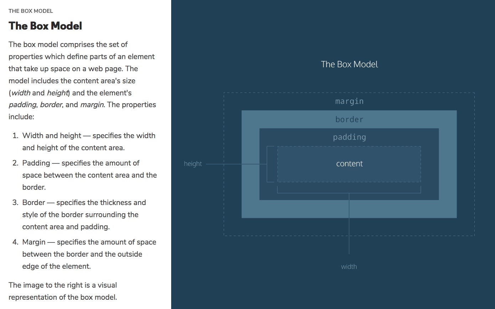

Grum's CSS notes
-------------------------------------------

Contains an overview of CSS covered in the Codecademy Web Path courses and [links](https://developer.mozilla.org/en-US/docs/Web/CSS) to Mozilla documentation. 

**Contents**

<!-- @import "[TOC]" {cmd="toc" depthFrom=1 depthTo=6 orderedList=false} -->

<!-- code_chunk_output -->

- [The Box Model](#the-box-model)
    - [`height`, `width`, `padding`, `borders`, and `margins`](#height-width-padding-borders-and-margins)
        - [Padding and margin arguments](#padding-and-margin-arguments)
- [Changing the Box Model from the default content-box to border-box](#changing-the-box-model-from-the-default-content-box-to-border-box)
    - [`box-sizing [content-box (default), border-box]`](#box-sizing-content-box-default-border-box)
- [Display and Positioning](#display-and-positioning)
    - [Layout - control the positioning of elements on a web page.](#layout---control-the-positioning-of-elements-on-a-web-page)
        - [`display` `: [inline, block, inline-block]`](#display--inline-block-inline-block)
        - [`position` `: static (default), relative, absolute, fixed`](#position--static-default-relative-absolute-fixed)
        - [`z-index` `: [int]`](#z-index--int)
        - [`float` `: [left, right]`](#float--left-right)
        - [`clear` `: [left, right, both]`](#clear--left-right-both)
- [Colors](#colors)
    - [`color` and `background-color` `[ keyword #, rgb, hsl, rgba, hsla]`;](#color-and-background-color--keyword--rgb-hsl-rgba-hsla)
    - [Solid colors - `keyword, #, rgb, hsl`](#solid-colors---keyword--rgb-hsl)
    - [Alpha and Opacity](#alpha-and-opacity)
        - [Setting with `rgba` and `hsla`](#setting-with-rgba-and-hsla)
        - [Setting via `opacity` `: real-decimal`](#setting-via-opacity--real-decimal)
- [Typography](#typography)
    - [Typography properties (`font-family` etc)](#typography-properties-font-family-etc)
    - [Loading additional fonts](#loading-additional-fonts)
        - [Loading externally from fonts.google.com](#loading-externally-from-fontsgooglecom)
        - [Loading internally using font files](#loading-internally-using-font-files)
- [Units](#units)

<!-- /code_chunk_output -->

---

# The Box Model
## `height`, `width`, `padding`, `borders`, and `margins`

* The five properties of the box model are: `height` and `width`, `padding`, `borders`, and `margins`.
* The box model uses the five properties to create space around and between HTML elements;

    *   [](./Codecademy-The_Box_Model_1-overview.jpg)

| Property | Effect |
| -------- | ------ |
| [`height`](https://developer.mozilla.org/en-US/docs/Web/CSS/@viewport/height)[[1]](#__display_warning) [`width`](https://developer.mozilla.org/en-US/docs/Web/CSS/width)[[1]](#__display_warning) | Sets content area in `px` or `%`.
| [`border`](https://developer.mozilla.org/en-US/docs/Web/CSS/border) | Surrounds the content area and padding of an element. The color, style, and thickness of a border can be set with CSS properties. <br>E.g. `border: 1px solid #eb6536` sets line width, type of line, and color of line
| [`padding`](https://developer.mozilla.org/en-US/docs/Web/CSS/padding)[[1]](#__display_warning) | Sets the `px` spacing between the content area and the border. It can be set in pixels or percent. Also, the [number of arguments](#__padding_margin_args) changes which faces the arg(s) apply to.
| [`margin`](https://developer.mozilla.org/en-US/docs/Web/CSS/margin)[[1]](#__display_warning) | Sets the `px` spacing outside of an element's border; <br> **1)** The [number of arguments](#__padding_margin_args) changes which faces the arg(s) apply to.<br>**2) `margin: 0 auto`** sets no top-bottom margins, but **horizontally centers** an element inside of its parent content area, if it has a width.<br>**3) Vertical margin collapse**: <br> **- Vertical** margins collapse, so the space between vertically adjacent elements is equal to the larger margin.<br> **- Horizontal** margins add, so the total space between the borders of adjacent elements is equal to the sum of the right margin of one element and the left margin of the adjacent element.<br>[](Codecademy-Virtual_Margins_Collapse.jpg)
| [`overflow`](https://developer.mozilla.org/en-US/docs/Web/CSS/overflow) | Property can be set to `display`, `hide`, or `scroll`, and dictates how HTML will render content that overflows its parent's content area.
| [`visibility`](https://developer.mozilla.org/en-US/docs/Web/CSS/visibility) |Property can hide or show elements.

<a id="__display_warning"></a> **[1] WARNING**: If the element [`display`](#display--inline-block-inline-block) defaults, or is set, to **`inline`**, it causes the element to be as small as possible and hence partially, or fully, negates any `height`, `width`, `padding` and `margin` settings.

<a id="__padding_margin_args"></a> 

### Padding and margin arguments

The number of arguments changes which faces the arguments apply to as follows;

| Args | Faces Applied To | Example |
| :--: | ---------------- | ------- |
| 1    | All four faces. | `padding: 20px;`
| 2    | 1st: Top & bottom<br>2nd: Both sides| `margin: 10px 20px;`
| 3    | 1st: Top<br>2nd: Both sides<br>3rd: Bottom| `padding: 10px 20px; 5px;`
| 4    | 1st: Top<br>2nd: Right side<br> 3rd: Bottom<br>4th: Left side |  `margin: 10px 20px 5px 50px;`


# Changing the Box Model from the default content-box to border-box

## `box-sizing [content-box (default), border-box]`
The box-sizing property controls the box model used by the browser;

| Setting | Effect |
| ------- | :----: |
| `content-box` | Box dimensions are affected by border thickness and padding, as they are external to the box and hence add to the content dimensions. <br>[](Codecademy-The_Box_Model_2-default_acutal_rendered_width.jpg)
| `border-box` | Box dimensions are not affected by border thickness or padding, instead they go into the box.<br> [](Codecademy-The_Box_Model_3-box-sizing_border-box.jpg)


# Display and Positioning

## Layout - control the positioning of elements on a web page.

### [`display`](https://developer.mozilla.org/en-US/docs/Web/CSS/display) `: [inline, block, inline-block]`
* The display property allows you control how an element flows vertically and horizontally a document.

| Setting | Effect |
| ------- | ------ |
| `inline` | Elements take up the minimum size required to contain the contents and cannot be altered in size with the `height` or `width` properties. See [here](https://developer.mozilla.org/en-US/docs/Web/HTML/Inline_elements) for more.
| `block` | Elements fill the entire width of the page by default, but their width property can also be set. Unless otherwise specified, they are the height necessary to accommodate their content. The main block-by-default elements are `<h1> through <h6>, <p>, <div> and <footer>`, see [here](https://developer.mozilla.org/en-US/docs/Web/HTML/Block-level_elements) for more.
| `inline-block` | Elements can also appear next to each other, can have set `width` and `height`, and do not take up their entire container width.

### [`position`](https://developer.mozilla.org/en-US/docs/Web/CSS/position) `: static (default), relative, absolute, fixed`

| Setting | Effect |
| ------- | ------ |
| `static` | Default value. Elements render in order, as they appear in the document flow
| `relative` | Position relative to its default position on the page, using `top`, `bottom`, `left`, `right` properties.
| `absolute` | Position relative to its first positioned (not static) ancestor element. It can be pinned to any part of the web page, but the element will still move with the rest of the document when the page is scrolled.
| `fixed` | Position pinned to any part of the web page. The element will remain in view no matter what. If an element's `position` is `fixed`; <br><br> 1) The element may be obscured underneath others, which `z-index: <a_suitably_big_int>` can bring the element forward. Other element(s) that are now underneath may need to have their position altered to be visiable again.  e.g. Set their `position:relative`, and then push them down using `top:<the_the_height_of_the_obscuring_element>px`.<br><br> 2) The element may shrink, which `width: 100%` can address, provided the `display` for the element is not `inline`.
| `sticky` | Position relative to its default position on the page until its containing block crosses a specified threshold (such as setting top to value other than auto) within its flow root (or the container it scrolls within), at which point it is treated as "stuck" until meeting the opposite edge of its containing block.

### [`z-index`](https://developer.mozilla.org/en-US/docs/Web/CSS/z-index) `: [int]`
* The `z-index` of an element specifies how far back or how far forward an element appears on the page when it overlaps other elements. 
* The higher the number, the closer to the top of the stack
* WARNING: z-index will not function if position either defaults, or is set to, static.
* See also [Using z-index](https://developer.mozilla.org/en-US/docs/Web/CSS/CSS_Positioning/Understanding_z_index/Adding_z-index) article

### [`float`](https://developer.mozilla.org/en-US/docs/Web/CSS/float) `: [left, right]`
* Move elements as far `left` or `right` as possible.
* Floated elements must have a `width` specified, otherwise the element will assume the full width of its containing element, and changing the float value will not yield any visible results.
* The float property can also be used to float multiple elements at once. However, when multiple floated elements have different heights, it can affect their layout on the page. Specifically, elements can "bump" into each other and not allow other elements to properly move the left or right.

### [`clear`](https://developer.mozilla.org/en-US/docs/Web/CSS/clear) `: [left, right, both]`

* When multiple `floated` elements have different heights, they can "bump" into each other and not allow other elements to properly move to the left or right.

* The `clear` property specifies how elements should behave when they bump into each other on the page. 

| Setting | Effect |
| ------- | ------ |
| `left` | The left side of the element will not touch any other element within the same containing element.
| `right` | The right side of the element will not touch any other element within the same containing element.
| `both` | Neither side of the element will touch any other element within the same containing element.
| `none` | The element can touch either side.

# Colors
## [`color`](https://developer.mozilla.org/en-US/docs/Web/CSS/color) and [`background-color`](https://developer.mozilla.org/en-US/docs/Web/CSS/background-color) `[ keyword #, rgb, hsl, rgba, hsla]`;

| Property | Effect |
| -------- | ------ |
| `color [ #, rgb, hsl, rgba, hsla]`<br>`background [ #, rgb, hsl, rgba, hsla]` | Sets element's foreground & backround respectively<br> as per schemes below.

## Solid colors - `keyword, #, rgb, hsl`

| Setting | Effect |
| ------- | ------ |
| `keyword` | See list [here](https://developer.mozilla.org/en-US/docs/Web/CSS/color_value#Color_keywords).  NB: Each color keyword has an equivalent #hex rgb value.
| `#hhhhhh` | 6 or 3 digit hexadecimal RGB color.  3 digit represents 6 digit where each pair is a double.  E.g. #00FFFF = #0FF
| `rgb(ddd, ddd, ddd)` | Specifies RGB values as 0-255 decimals
| `hsl(ddd, ddd%, ddd%)` | [](./color_wheel_4_background.svg)<br> 1) 0-360º Hue. As per color wheel. 0/360 = Red, 120 = green, 240 = blue.<br>2) 0-100% Saturation.  Less is toward center of wheel (greyer) and more moves to perimeter (richer) <br>3)  0-100% Lightness. 50% = normal, 0% = black, 100% = white

* See [RGB to HSL color conversion](https://www.rapidtables.com/convert/color/rgb-to-hsl.html).

## Alpha and Opacity

### Setting with `rgba` and `hsla`

Setting | Effect
------- | -------
`rgba(ddd, ddd, ddd, 0-1)`<br><br>`hsla(ddd, ddd%, ddd%, 0-1)` | 1) The first three arguments specify the color as<br> per rgb & hsl above.<br><br> 2) Opacity is set by the last real decimal valve.  <br>0.0 = transparent, 1.0 = opaque.

### Setting via [`opacity`](https://developer.mozilla.org/en-US/docs/Web/CSS/opacity) `: real-decimal`

# Typography
## Typography properties (`font-family` etc)

| Property<br> (linked) | Arguments | Notes |
| :------: | :-------: | ----- |
| [`font-family`](https://developer.mozilla.org/en-US/docs/Web/CSS/font-family) | font-name,<br> fallback-font1, ... ,<br> [serif, sans-serif] | 1) If font-name is not<br>available, use fallbacks<br> or system serif/sans-serif.<br>2) Quote name if name<br> contains spaces.
| [`font-weight`](https://developer.mozilla.org/en-US/docs/Web/CSS/font-weight) | `bold`, `normal`,<br> `100`-`900` in 100's | 400 is usually default,<br> 700 is bold, 300 is light.
| [`font-style`](https://developer.mozilla.org/en-US/docs/Web/CSS/font-style) | `italic`, `normal`,<br> `oblique <angle>?`
| [`word-spacing`](https://developer.mozilla.org/en-US/docs/Web/CSS/word-spacing) | `normal` `unit` | Default is 0.25em. <br>NB: `em` unit preferred.
| [`letter-spacing`](https://developer.mozilla.org/en-US/docs/Web/CSS/letter-spacing) | `normal` `unit` | Aka 'kerning'. <br>NB: `em` unit preferred.
| [`text-transform`](https://developer.mozilla.org/en-US/docs/Web/CSS/text-transform) | `none` `capitalize`<br> `uppercase` `lowercase`<br> `full-width`
| [`text-align`](https://developer.mozilla.org/en-US/docs/Web/CSS/text-align) | `left`, `center`, `right`
| [`line-height`](https://developer.mozilla.org/en-US/docs/Web/CSS/line-height) | `normal` `%` `unit`<br> `unitless-number` | [](./Codecademy-Line_Height_Anatomy.jpg) <br>`unitless-number`<br>computes the line<br> height as a ratio of<br> the font size.

## Loading additional fonts
See my example of using the below [here](https://grumbit.github.io/webPathProjects/4_Getting_More_Advanced_With_Design/Grum_extra-Typography/index.html).
### Loading externally from fonts.google.com
1. Search for fonts
2. Having found a font, add it and select the variations (e.g. regualr (400) and 
3. When all are saved, open the bottom-right widget and link **or** import the font(s);
    1. Link fonts via index.html;
        - Copy-and-paste the provided \<link\> tag into the \<head\> tag of index.html. E.g.
            ```html
            <link href="https://fonts.googleapis.com/css?family=Space+Mono" rel="stylesheet">
            ```
    2. Import @font-face via style.css
        - Copy-and-paste the provided \<link\> tag into a browser.
        - From the raw css displayed, copy-and-paste all the `/* latin */` @font-face {...} blocks into the _**top**_ of style.css.
            ```css
            @font-face {
                font-family: 'Space Mono';
                font-style: normal;
                font-weight: 700;
                src: local('Space Mono Bold'), local('SpaceMono-Bold'), url(https://fonts.gstatic.com/s/spacemono/v1/vdpMRWfyjfCvDYTz00NEPGaVI6zN22yiurzcBKxPjFE.woff2) format('woff2');
                unicode-range: U+0000-00FF, U+0131, U+0152-0153, U+02C6, U+02DA, U+02DC, U+2000-206F, U+2074, U+20AC, U+2212, U+2215;
                }
            ```
4. Add font rules to selector
- Copy-and-paste the font rules in to the appropriate selector of style.css.
    ```css
    <some_css_selector> {
        font-family: "Space Mono", monospace;
    }
    ```

### Loading internally using font files
1. Download font files from somewhere like fontsquirrel.com, into a suitable location such as ./fonts
2. For each font file, add an appropriate @font-face entry into style.css. E.g.;
    ```css
    /* The 2 @font-face below bring in regular and bold versions of the Glegoo font.
       Note the font-weight's 400 & 700 are required to set them up correctly */
    @font-face {
        font-family: "Glegoo";
        font-style: normal;
        font-weight: 400;
        src: url(fonts/Glegoo-Regular.ttf) format('truetype');
    }
    @font-face {
        font-family: "Glegoo";
        font-style: normal;
        font-weight: 700;
        src: url(fonts/Glegoo-Bold.ttf) format('truetype');
    }
    ```
 
# Units

- Overview of units that can be applied when sizing elements.

| Unit | Description | Example |
| :--: | ----------- | ------- |
| `px`  | Hard-coded number of pixels | `padding: `**`20px`**`;`
| `em`  | Multiple of base (i.e. parent element's) font-size.<br>Use when sizing elements in comparison to other<br> elements nearby.| `font-size: `**`1.25em`**`;`
| `rem` | Multiple of root element (i.e. \<html\> tag) font-size.<br>Use when sizing elements consistently <br>across entire page. |`line-height: `**`1.6rem`**`;`
| `%`   | Size element relative to the dimensions of parent<br> element (i.e. container).<br>**NB:** For `padding` & `margin`, the `%` for all four sides <br>is computed using the **width** of the **parent** element.<br>**WARNING**: If used with box-model, may<br> cause overflow problems | `width: `**`60%`**`;`